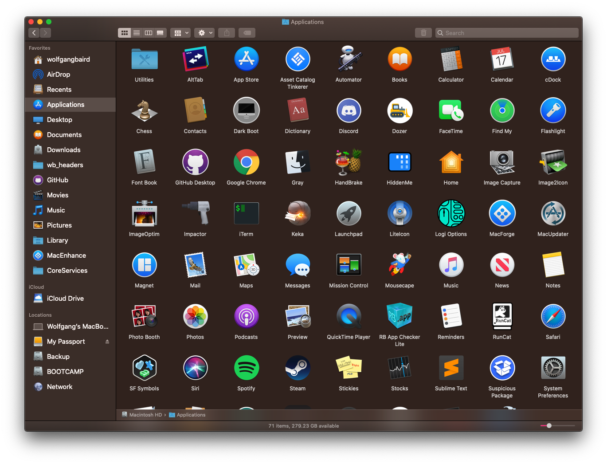

# colorfulSidebar9

 

# Information:

- Designed for 10.9+   
- colorfulSidebar9 is a SIMBL plugin that brings back finder sidebar color on OS X    
- Author: [w0lfschild](https://github.com/w0lfschild)

# Note:

- You can customize the icons used by editing `icons.plist` or `icons10.plist`

# Installation:

1. Download [mySIMBL](https://github.com/w0lfschild/app_updates/raw/master/mySIMBL/mySIMBL_0.2.5.zip)
2. Download [colorfulSidebar9](https://github.com/w0lfschild/colorfulSidebar_9/raw/master/build/colorfulSidebar9.zip)
3. Unzip downloads
4. Open `colorfulSidebar9.bundle` with `mySIMBL.app`
5. Restart Finder
	
### License:
Pretty much the BSD license, just don't repackage it and call it your own please!    
Also if you do make some changes, feel free to make a pull request and help make things more awesome!
